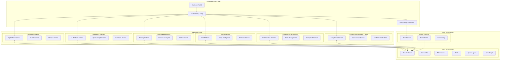

```mermaid
graph TB
    subgraph "Customer Access Layer"
        Portal[Customer Portal]
        API[API Gateway - Kong]
        SSO[SSO/Identity Federation]
    end
    
    subgraph "Application Suite"
        subgraph "Digital Asset Nexus"
            DAS[Digital Asset Service]
            SS[Search Service]
            STS[Storage Service]
        end
        
        subgraph "Intelligence Platform"
            ML[ML Platform Service]
            QO[Quantum Optimization]
            FN[Functions Service]
        end
        
        subgraph "TradeStream Platform"
            TP[Trading Platform]
            DE[Derivatives Engine]
            DF[DeFi Protocols]
        end
        
        subgraph "DataVerse Hub"
            DP[Data Platform]
            GI[Graph Intelligence]
            AN[Analytics Service]
        end
        
        subgraph "Collaboration Workspace"
            CP[Collaboration Platform]
            SM[State Management]
            CA[Compute Allocation]
        end
        
        subgraph "Compliance Command Center"
            CS[Compliance Service]
            GS[Governance Service]
            VC[Verifiable Credentials]
        end
    end
    
    subgraph "Core Infrastructure"
        subgraph "Shared Services"
            AUTH[Auth Service]
            EVT[Event Router]
            PROV[Provisioning]
        end
        
        subgraph "Data Infrastructure"
            PULSAR[Apache Pulsar]
            CASS[Cassandra]
            ES[Elasticsearch]
            MINIO[MinIO]
            IGNITE[Apache Ignite]
            JANUS[JanusGraph]
        end
    end
    
    Portal --> API
    API --> SSO
    SSO --> AUTH
    
    API --> DAS
    API --> ML
    API --> TP
    API --> DP
    API --> CP
    API --> CS
    
    DAS <--> PULSAR
    ML <--> PULSAR
    TP <--> PULSAR
    DP <--> PULSAR
    CP <--> PULSAR
    CS <--> PULSAR
    
    EVT --> PULSAR
```
